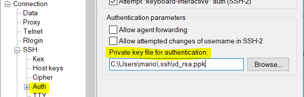
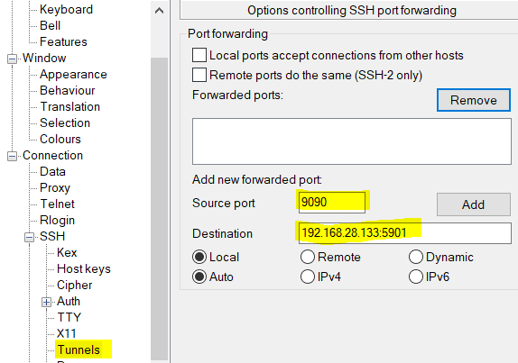

# GK 10.2.1 Fernwartung
Mario Fentler 5CHIT  
25.02.2019  

## Aufgabenstellung
- __SSH-Server Public Key Authentifizierung:__  
Es soll ein SSH-Zugang für eine Autentifizierung mittels Public-Key-Verfahren konfiguriert werden. Dazu soll am Client ein Schlüsselpaar erstellt, der öffentliche Teil der Schlüssel auf den Server übertragen und anschließend der Server für die Schlüssel-Authentifizierung eingerichtet werden. Anschließend soll der Benutzer ohne Login-Passwort am Server angemeldet werden können.  
- __Konfiguration eines SSH-Tunnels für den Internet-Zugriff über einen remote Server:__  
Es soll ein sicherer Fernzugriff via TightVNC zu einem Linux-Server ermöglicht werden. Dazu soll ein SSH-Tunnel eingesetzt werden.

## Vorraussetzung
- Eine Linux VM  
- Putty
- GitBash
- Tight VNC Viewer

## Durchführung
### Aufgabe 1 - Public Key Auth.:
Als erster Schritt wird die Linux Maschine für __ssh eingerichtet__. Dazu wird __openssh-server__ herunter geladen und anschließend über den Windows Host versucht sich mit ssh darauf zu verbinden.  
```bash
sudo apt-get install openssh-server

//Windows:
ssh <user>@<server-ip>
```
Nachdem man das Passwort für den Linux User eingegeben hat, sollte man nun mit dem Server verbunden sein.  

Nun wird am Client(Windows) ein __SSH-Key erstellt__. Ich habe das nicht gemacht, da ich schon zu einem früheren Zeitpunkt einen für GitHub erstellt hatte. Wenn man allerdings keinen hat, dann benützt man folgende Commands. Am besten verwendet man für die gesamten Befehle auf dem Client die __Git-Bash__, da diese Linux Befehle ausführen kann:  
```bash
ssh-keygen -b 4096
```
Wenn man möchte kann man bei der Erstellung des Keys auch ein Passwort dafür setzen, um so den Schlüssel __sicherer zu machen__. Weil wenn man das nicht hat und jemand an den privat Key kommt, kann der sich einfach damit einloggen. Hier in der Übung wurde das aber weggelassen.  

Nun muss der __Public Key vom Client auf den Server übertragen__ werden:  
```bash
ssh-copy-id -i .ssh/key_rsa.pub <user>@<server-ip>
```

Das ganze testet man mit folgendem Befehl. Nun sollte man __kein Passwort__ mehr eingeben müssen und __direkt__ mit dem Server __verbunden__ sein.  
```bash
ssh -i .ssh/key_rsa <user>@<server-ip>
```


## Aufgabe 2 - SSH Tunnel
_"TightVNC is a connection system that allows you to use your keyboard and mouse to interact with a graphical desktop environment on a remote server. It makes managing files, software, and settings on a remote server easier for users who are not yet comfortable with the command line."_ - [2]

### VNC - [2]
Auf dem Server muss nun VNC installiert werden. Der VNC Server läuft standardmäßig auf Port 5900 + X.  
X ... Connection  

-> Erste Connection :5901
Zweite :5092
```bash
sudo apt-get update
sudo apt install xfce4 xfce4-goodies tightvncserver
```
```bash
vncserver
```
Nun wird man nach einem Passwort gefragt. ReadOnly User Passwort brauchen wir nicht.

Anschließend wird der VNC Server noch konfiguriert. Dazu muss die laufende Insatz gekillt werden und ein Backup des Servers erstellt werden.  
```bash 
vncserver -kill :1
```
Jetzt wird ein Startup File erstellt, dass immer ausgeführt werden soll wenn der Server startet.  
```bash
nano ~/.vnc/xstartup

//Inhalt
#!/bin/bash
xrdb $HOME/.Xresources
startxfce4 &
```
Die Berechtigungen des Servers auf dieses File werden nun noch verändert.
```bash
sudo chmod +x ~/.vnc/xstartup
```

Nun kann der Server wieder gestartet werden.
```bash
vncserver
```
### Putty
#### Key umwandeln
Um sich mit Putty über den SSH-Tunnel mit dem vorher erstellten Key zu verbinden muss dieser erst in einen "Putty-Key" umgewandelt werden. [3]  
Dazu verwendet man die Software __Puttygen__, die bei der Installation von Putty mit installiert wird.  
Dort: _"File/Load Privat Key/Save Privat Key"_. Am besten direkt als __id_rsa.ppk__ abspeichern.  

Dieser Key wird nun in Putty als Parameter für die Authentifizierung hinzugefügt. Dazu unter SSH/Auth das File auswählen.  


#### Tunnel Einstellung
In Putty lässt sich auch ein SSH-Tunnel einstellen. Dazu unter SSH/Tunnels das Port Forwarding eintragen. Anschließend ist der Server über Port 9090 erreichbar.  


### VNC-Viewer
Um eine grafische Benutzeroberfläche vom Server zu bekommen können jetzt zwei Anwendungen verwendet werden. _VNC-Viewer_ oder _TightVNC_.  

Dort wählt man einfach als Verbindung __localhost:\<vorherDefiniert>__

## Quellen
[1] - https://www.thomas-krenn.com/de/wiki/OpenSSH_Public_Key_Authentifizierung_unter_Ubuntu  
[2] - https://www.digitalocean.com/community/tutorials/how-to-install-and-configure-vnc-on-ubuntu-16-04  
[3] - https://www.cnx-software.com/2012/07/20/how-use-putty-with-an-ssh-private-key-generated-by-openssh/  